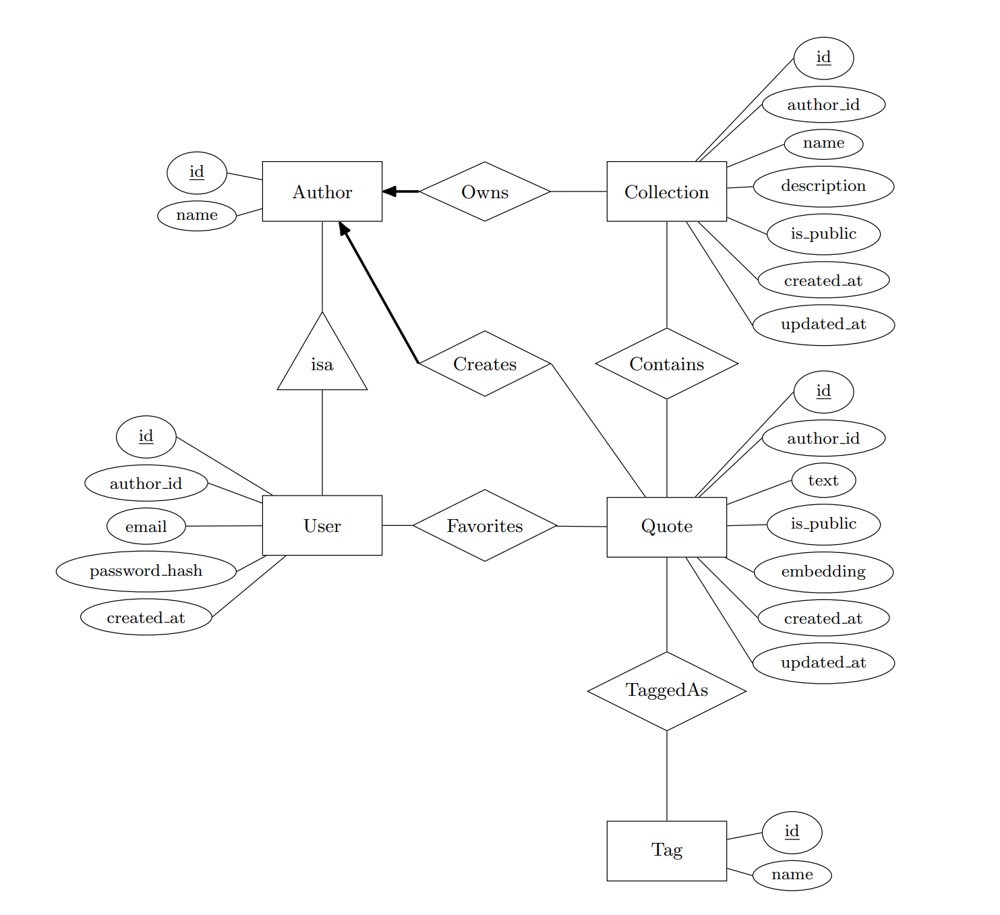

# QuoteWeave

QuoteWeave: a site to create, find, and share quotes.

## How to compile and run our web-app

### Prerequisites
- Docker
- Docker Compose

### Compilation & Initialization
The application is containerized using Docker. The database schema is defined in `backend/schema.postgresql` and initial data population is handled by scripts.

To build and run the application:

1.  **Build and Run with Docker Compose**:
    Open a terminal in the project's root directory (where `docker-compose.yml` is located) and run:
    ```bash
    docker-compose up -d --build
    ```
    This command will:
    *   Build the Docker images for the backend and frontend.
    *   Start the services (application, database).
    *   The `backend/prestart.sh` script will automatically run, which:
        *   Initializes the database schema using `backend/schema.postgresql`.
        *   Populates the database with sample data via `python cli.py populate-full`.
        *   Creates a default admin user.
    *   **Note**: This command might take several minutes to complete, especially on the first run.
    *   **Important**: After the services are up, please monitor the Docker logs (e.g., using `docker-compose logs -f backend`). Wait for the message `============================= FINISHED SETUP. READY TO USE =============================` before interacting with the application, especially features like semantic search.

### How to Interact with Our Web-App
Once the `docker-compose up` command completes successfully:
- The web application will be accessible at [http://localhost:3000](http://localhost:3000).
- The backend API will be accessible at [http://localhost:8000](http://localhost:8000) (with API docs at [http://localhost:8000/docs](http://localhost:8000/docs)).

## Quirks

- If "could not validate credentials", it means that the JWT token has expired and that you need to log out and log in again.
- You can only delete and edit a quote if the username matches the author exactly.
- The user password (`password_hash` in the diagram and schema) is hashed. For demonstration purposes, this hashing is deterministic due to the use of static salts, which is not secure for production.

## Demo Credentials

For demonstration purposes, you can use the following credentials:
- **Username** (must not contain any spaces): user
- **Email**: user@example.com
- **Password**: 123abc@XYZ

## Database Model (E/R Diagram)



The relations are shown below. The full diagram can also be found in `diagram/diagram.pdf`.

```
Author(id:integer, name:text)
User(id:integer, author_id:integer, email:text, password_hash:text, created_at:timestamptz)
Collection(id:integer, author_id:integer, name:text, description:text, is_public:boolean, created_at:timestamptz, updated_at:timestamptz)
Quote(id:integer, author_id:integer, text:text, is_public:boolean, embedding:vector, created_at:timestamptz, updated_at:timestamptz)
TaggedAs(quote_id:integer, tag_id:integer)
Tag(id:integer, name:text)
UserQuoteFavorite(user_id:integer, quote_id:integer, created_at:timestamptz)
CollectionContains(collection_id:integer, quote_id:integer, added_at:timestamptz)
```

## Web-app Features

The QuoteWeave web application:

-   **Interacts with the database via SQL**: The backend application uses SQL to perform CRUD (Create, Read, Update, Delete) operations on entities such as Quotes, Collections, Users, Authors, and Tags. These database interactions are managed by custom CRUD functions in `backend/app/crud.py` which use the `psycopg` library to directly execute SQL statements.
-   **Performs regular expression matching**: The application supports regular expression matching for searching collections.
-   **Semantic Tagging**: The application uses a FLAN-T5 small model, fine-tuned with a custom loss function, to automatically generate relevant tags for quotes. The model is hosted on Hugging Face at [fristrup/flan-t5-semantic-tagger-small](https://huggingface.co/fristrup/flan-t5-semantic-tagger-small). The tagging functionality is implemented in `backend/app/tagging.py`, and the model training process, including the custom loss function, is detailed in the Jupyter notebook `models/notebooks/flan_training.ipynb`.
-   **Theme Customization**: Users can choose between light, dark, or system default themes. This setting is accessible on the settings page (`frontend/app/settings/page.tsx`) when logged in.

## Screenshots

### Hero (Landing Page)


### Create Quote with AI Tagging (Light Mode)


### Semantic Search (Dark Mode)


### Collections (Light Mode)


### Collection Not Found / Private Access (Light Mode)


## Project Repository
The git repository for this project contains all source code, the E/R diagram, and this README file.

## Repository Structure

The main directories in this repository are:

- `backend/`: Contains the Python backend server (FastAPI).
- `frontend/`: Contains the current Next.js frontend application.
- `models/`: Contains resources related to machine learning models, including notebooks for training.
- `diagram/`: Contains the E/R diagram source file (`main.tex`) and the rendered PDF (`diagram.pdf`).
- `assets/`: Contains images and other static assets used in the README and potentially by the application.
